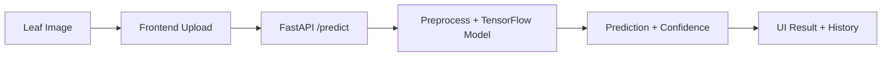

<div align="center">

# AgroVision: Potato Disease Detection

AI-powered potato leaf diagnosis in seconds. Upload an image, get a clear disease classification with confidence, and take action fast.


</div>

## Overview
AgroVision is a modern AI application that detects potato leaf diseases using a convolutional neural network. It solves the real-world challenge of early crop disease identification by turning a single leaf image into a fast, reliable diagnostic signal for farmers and agronomists.

## Key Features
- Instant disease prediction with confidence scoring.
- Clean, responsive UI with image preview and guided next steps.
- Drag-and-drop image upload and validation.
- Local scan history for quick reference.
- FastAPI inference service with CORS configured for local development.

## System Architecture


The React frontend handles image upload and UX, the FastAPI backend performs preprocessing and model inference, and results are streamed back to the UI with confidence and guidance.

## Getting Started
### 1) Clone the repository
```bash
git clone <your-repo-url>
cd Potato-disease
```

### 2) Backend setup
```bash
python -m venv .venv
source .venv/bin/activate  # on Windows: .venv\Scripts\activate
pip install -r api/requirement.txt
python -m api.main
```

API runs at: http://localhost:8080

### 3) Frontend setup
```bash
cd frontend
npm install
npm run dev
```

Frontend runs at: http://localhost:5173

### 4) Environment variables (optional)
Create frontend/.env with:
```
VITE_API_URL=http://localhost:8080
```

## Usage Examples
### Predict from the UI
1. Open http://localhost:5173
2. Upload a leaf image
3. View prediction + confidence

### Health check
```bash
curl http://localhost:8080/ping
```

### Predict via API
```bash
curl -X POST http://localhost:8080/predict \
	-H "Content-Type: multipart/form-data" \
	-F "file=@/path/to/leaf.jpg"
```

## Project Roadmap
- [ ] Add model versioning metadata to responses
- [ ] Add automated tests for inference and UI state
- [ ] Add image quality scoring before prediction
- [ ] Deploy to a production API service

## Contributing & License
Contributions are welcome. Please open an issue to discuss changes and submit a PR with clear context and testing notes.

This project is licensed under the MIT License.
